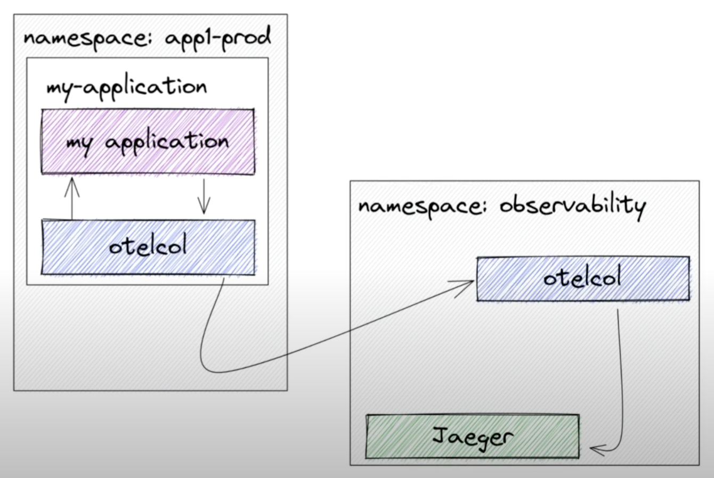
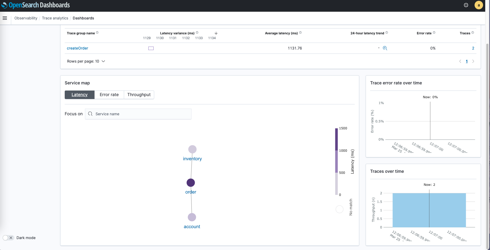

# opentelemetry-poc
## Deploy Opentelemetry Collector in Kubernetes
### Deployment Patterns
#### Daemonset Mode
The Oentelemetry Collector run as an agent in each Kubernetes node. It sends data to another external collector deployed as a standlone deployment. 
<p align="center"></p>

#### Sidecar Mode
One instances of Oentelemetry Collector exists as a container alongside each pod running business application(s), playing the role of an agent. It sends data to another external collector deployed as a standlone deployment. 
<p align="center"></p>  

### Deployment with Helm
Add OpenTelemetry Helm repository:
```bash
helm repo add open-telemetry https://open-telemetry.github.io/opentelemetry-helm-charts
```
This repository contains 2 charts: `opentelemetry-collector` & `opentelemetry-operator`

#### Opentelemetry Collector Helm Chart
By default [this chart](https://github.com/open-telemetry/opentelemetry-helm-charts/tree/opentelemetry-operator-0.6.5/charts/opentelemetry-collector) will deploy an OpenTelemetry Collector as daemonset. It can also install the collector as a standalone deployment + a daemonset as an agent.
```yaml
agentCollector:
  enabled: true
standaloneCollector:
  enabled: true
```
#### Opentelemetry Operator Helm Chart
[This chart](https://github.com/open-telemetry/opentelemetry-helm-charts/tree/opentelemetry-operator-0.6.5/charts/opentelemetry-operator) installs OpenTelemetry Operator in Kubernetes cluster. The [OpenTelemetry Operator](https://github.com/open-telemetry/opentelemetry-operator/tree/v0.47.0) is an implementation of a Kubernetes Operator and manage the `OpenTelemetryCollector` and `Instrumentation` components. It requests `cert-manager` to be installed.

The `CustomResource` for the `OpenTelemetryCollector` exposes a property named `.Spec.Mode`, which can be used to specify whether the collector should run as a `DaemonSet`, `Sidecar`, or `Deployment` (default).  

**Sidecar Injection**  

A sidecar with the OpenTelemetry Collector can be injected into pod-based workloads by setting the pod annotation `sidecar.opentelemetry.io/inject` to either `"true"`, or to the name of a concrete OpenTelemetryCollector from the same namespace.

**Auto-instrumentation Injection**  

The operator can inject and configure OpenTelemetry auto-instrumentation libraries. Currently `Java`, `NodeJS` and `Python` are supported. To use auto-instrumentation, configure an `Instrumentation` resource with the configuration for the SDK and instrumentation. 

Then add an annotation to a pod to enable injection. For Python, add annotation `instrumentation.opentelemetry.io/inject-python: "true"` in pod sepc.

## OpenTelemetry + OpenSearch
### Architecture 
Main components:
- **Agent** (OpenTelemetry collector - sidecar) 
- **Collector** (OpenTelemetry collector - deployment)
- **Transformer** (Data Prepper)
- **Data storage** (OpenSearch)
- **Visualization frontend** (OpenSearch Dashboard)

### Basic Flow of Data
<p align="center"></p>  

- **OpenTelemetry** receives trace data from the application and formats it into OpenTelemetry data.
- **OpenSearch** as the sink for the traces.
- **Data Prepper** processes the OpenTelemetry data, **transforms** it for use in OpenSearch, and indexes it on an OpenSearch cluster.

### Steps
#### Install Data Prepper
```
kubectl apply -f otel-opensearch/data-prepper.yaml
```
#### Install OpenTelemetry Collector 
Install collector as a standlone deployment. Set the exporter endpoint to the data prepper. Chart values are [here](otel-opensearch/otel-values.yaml). 
```
helm repo add open-telemetry https://open-telemetry.github.io/opentelemetry-helm-charts
helm repo update
helm install otel-collector open-telemetry/opentelemetry-collector -f otel-opensearch/otel-values.yaml
```
#### Install OpenTelemetry Operator
Install the operator to enable sidecar injection.
```
helm install otel-operator open-telemetry/opentelemetry-operator
```
Create the `CustomResource` - `OpenTelemetryCollector` (mode: **sidecar**). Set the exporter endpoint to the standlone collector. 
```
kubectl apply -f otel-opensearch/otel-operator.yaml
```
#### Deploy the Demo App in Java
```
kubectl apply -f otel-opensearch/demo-app-java.yaml
```
Exec into the pod and make calls to the `/orders` endpoint. It will generate a few spans.
```
curl localhost:8080/order
Created
```
#### View Trace Analytics in OpenSearch Dashboards
`OpenSearch -> Observability -> Traces analytics`
   
`OpenSearch -> Observability -> Traces analytics -> Traces`
 

## OpenTelemetry + Jaeger
### Architecture 
Main components:
- **Agent** (OpenTelemetry collector - sidecar) 
- **Collector** (Jaeger collector - deployment)
- **Data storage** (Jaeger in-memory storage)
- **Visualization frontend** (Jaeger query)
### Steps
#### Install Jaeger
Similar to OpenTelemetry, Jaeger can be deployed using [Jaeger helm chart](https://github.com/jaegertracing/helm-charts/tree/jaeger-operator-2.29.0/charts/jaeger) or [Jaeger Operator helm chart](https://github.com/jaegertracing/helm-charts/tree/jaeger-operator-2.29.0/charts/jaeger-operator).  

Jaeger helm chart will deploy jaeger-agent as a DaemonSet and deploy the jaeger-collector and jaeger-query components as Deployments.  

[Jager Operator](https://github.com/jaegertracing/jaeger-operator/tree/v1.32.0) manages the `CustomResource` - `Jaeger`.  

For large scale production deployment, the Jaeger team recommends Elasticsearch as backend data storage over Cassandra.  

In this POC, install Jaeger [all-in-one](https://www.jaegertracing.io/docs/1.29/getting-started/#all-in-one) mode using Jaeger Operator.
```
helm repo add jaegertracing https://jaegertracing.github.io/helm-charts
helm install jaeger jaegertracing/jaeger-operator
kubectl apply -f otel-jaeger/jaeger-all-in-one.yaml
```
#### Install OpenTelemetry Operator
Install the operator to enable sidecar injection.
```
helm install otel-operator open-telemetry/opentelemetry-operator
```
Create the `CustomResource` - `OpenTelemetryCollector` (mode: **sidecar**). Set the exporter endpoint to the Jaeger. 
```
kubectl apply -f otel-jaeger/otel-operator.yaml
```
#### Deploy the Demo App in Python
Build and push the Docker image with OpenTelemetry **auto-instrumentation**. 
Deploy the demo app with OpenTelemetry sidecar injection & environment variables.
```yaml
env:
  - name: OTEL_TRACES_EXPORTER
    value: "otlp"
  - name: OTEL_EXPORTER_OTLP_ENDPOINT
    value: "http://localhost:4317"
  - name: OTEL_RESOURCE_ATTRIBUTES
    value: "service.name=myapp-python"
```
```
kubectl apply -f otel-jaeger/demo-app-python.yaml
```
Exec into the pod and make calls to generate spans.
```
curl -s "localhost:5000/?url=https://en.wikipedia.org/wiki/Mars"  > /dev/null
```

#### View Traces in Jaeger UI
Jaeger UI main page
   
View traces from `myapp-python`
 

## References
- https://opensearch.org/docs/latest/observability-plugin/trace/get-started/  
- https://opensearch.org/blog/technical-post/2021/12/distributed-tracing-pipeline-with-opentelemetry/  
- https://medium.com/opentelemetry/deploying-the-opentelemetry-collector-on-kubernetes-2256eca569c9  
- https://github.com/open-telemetry/opentelemetry-operator/tree/v0.47.0  
- https://github.com/open-telemetry/opentelemetry-helm-charts/tree/opentelemetry-operator-0.6.5/charts/opentelemetry-collector
- https://github.com/open-telemetry/opentelemetry-helm-charts/tree/opentelemetry-operator-0.6.5/charts/opentelemetry-operator
- https://logz.io/blog/python-opentelemetry-auto-instrumentation/#collect
- https://medium.com/opentelemetry/using-opentelemetry-auto-instrumentation-agents-in-kubernetes-869ec0f42377
- https://github.com/lightstep/opentelemetry-examples/tree/main/python/opentelemetry
- https://github.com/jaegertracing/helm-charts/tree/jaeger-operator-2.29.0
- https://github.com/jaegertracing/jaeger-operator/tree/v1.32.0
- https://levelup.gitconnected.com/python-auto-instrumentation-with-opentelemetry-ccd603c665af